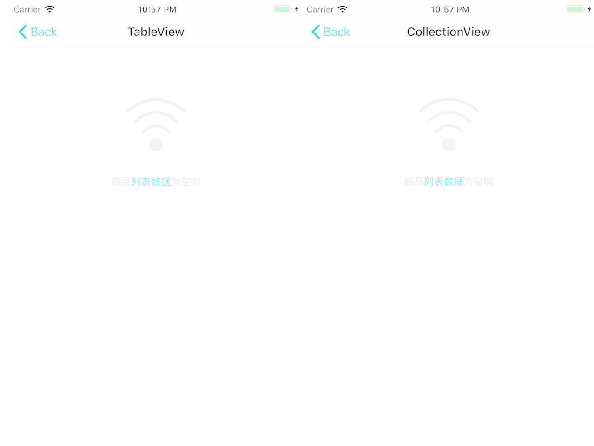

# EmptyDataView

  EmptyDataView是处理UITableView和UIcollectionview列表为空时自定义展示空界面

  ## 预览


## 使用要求

- Xcode 9.0+

## 安装

### CocoaPods

```ruby
pod 'EmptyDataView', '~> 0.0.1'
```

## 具体使用

### UITableView

#### 设置代理

```swift
     test_Tv.dzn_tv_emptyDataSource = self
     test_Tv.dzn_tv_emptyDelegate = self
     /// tableview 需要设置tableFooterView
     test_Tv.tableFooterView = UIView()
```
#### 代理实现

EmptyDataSource
```swift
extension Test_TVc:EmptyDataSource{
    /**
     配置空数据时显示的副标题（描述）
     
     - Parameter scrollView: 目标视图
     
     - Returns: 副标题（描述）
     
     */
    func description(emptyView scrollView: UIScrollView) -> NSAttributedString? {
        var attributes: [NSAttributedStringKey:Any] = [:]
        attributes[NSAttributedStringKey.font] = UIFont.systemFont(ofSize: 17)
        attributes[NSAttributedStringKey.foregroundColor] = UIColor.red
        let paragraph = NSMutableParagraphStyle()
        paragraph.alignment = .center
        attributes[NSAttributedStringKey.paragraphStyle] = paragraph
        let attributedString =  NSMutableAttributedString(string: "商品列表数据为空啊", attributes: nil)
        let range = (attributedString.string as NSString).range(of: "列表数据")
        attributedString.addAttributes([NSAttributedStringKey.foregroundColor: #colorLiteral(red: 0, green: 0.6784313725, blue: 0.9450980392, alpha: 1)], range: range)
        return attributedString
    }
}
```
EmptyDelegate
```swift
extension Test_TVc :EmptyDelegate{
    /**
     配置是否允许显示空视图
     
     - Parameter scrollView: 目标视图
     
     - Returns:  是否显示
     - true 显示 (default)
     - false 不显示
     
     */
     func shouldDisplay(emptyView scrollView: UIScrollView) -> Bool{
        return true
    }
     func didTap(emptyView scrollView: UIScrollView, button: UIButton){
        
    }
}
```

### UICollectionView

#### 设置代理
```swift
    self.test_Cv.dzn_Cv_emptyDelegate = self
    self.test_Cv.dzn_Cv_emptyDataSource = self
```
#### 代理实现
EmptyDataSource
```swift
extension Test_CVc:EmptyDataSource{
    /**
     配置空数据时显示的副标题（描述）
     
     - Parameter scrollView: 目标视图
     
     - Returns: 副标题（描述）
     
     */
    func description(emptyView scrollView: UIScrollView) -> NSAttributedString? {
        var attributes: [NSAttributedStringKey:Any] = [:]
        attributes[NSAttributedStringKey.font] = UIFont.systemFont(ofSize: 17)
        attributes[NSAttributedStringKey.foregroundColor] = UIColor.red
        let paragraph = NSMutableParagraphStyle()
        paragraph.alignment = .center
        attributes[NSAttributedStringKey.paragraphStyle] = paragraph
        let attributedString =  NSMutableAttributedString(string: "商品列表数据为空啊", attributes: nil)
        let range = (attributedString.string as NSString).range(of: "列表数据")
        attributedString.addAttributes([NSAttributedStringKey.foregroundColor: #colorLiteral(red: 0, green: 0.6784313725, blue: 0.9450980392, alpha: 1)], range: range)
        return attributedString
    }
    
}
```
EmptyDelegate
```swift
extension Test_CVc :EmptyDelegate{
    /**
     配置是否允许显示空视图
     
     - Parameter scrollView: 目标视图
     
     - Returns:  是否显示
     - true 显示 (default)
     - false 不显示
     
     */
     func shouldDisplay(emptyView scrollView: UIScrollView) -> Bool{
        return true
    }
     func didTap(emptyView scrollView: UIScrollView, button: UIButton){
        
    }
}
```
